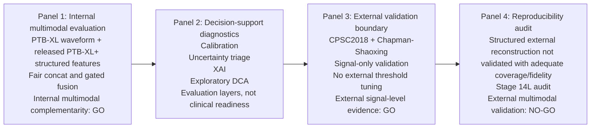

# Stage 16: BMC MIDM Submission Finalization Pass

Date: 2026-06-30

Target journal: **BMC Medical Informatics and Decision Making**

Single-file delivery note: this document consolidates the Stage 16 reference audit, bibliography lock, manuscript insertion text, final figure plan, visual abstract draft, cover letter draft, dataset/code URL status, final claim audit, and submission checklist into one Markdown file.

## 1. Locked Evidence Boundary

Allowed manuscript evidence:

- Internal PTB-XL/PTB-XL+ multimodal evaluation.
- Signal-only external validation on CPSC2018 and Chapman-Shaoxing.
- Stage 14L as a structured-feature reproducibility and feasibility audit.
- Calibration, uncertainty triage, XAI, and exploratory DCA as conservative decision-support evaluation layers.

Forbidden manuscript claims:

- External multimodal validation was performed.
- Gated fusion is statistically clearly better than fair concat.
- Exact external PTB-XL+ 531-column structured-feature reconstruction was achieved.
- Candidate ECGdeli/prototype features are official PTB-XL+ external structured features.
- The framework is clinically ready, clinically validated, deployable, or ready for real-world use.

## 2. Manuscript Title Lock

Recommended BMC MIDM title:

**A Reproducibility-Aware Decision-Support Evaluation Framework for Multimodal ECG Risk Stratification**

Acceptable alternative:

**Reproducibility-Aware Multimodal ECG Risk Stratification with Signal-Level External Validation**

The first title is preferred because it foregrounds the BMC MIDM-compatible contribution: conservative decision-support evaluation under public-data reproducibility constraints.

## 3. Statistical Analysis Insertion

Add this sentence to the Statistical analysis subsection immediately after paired bootstrap comparisons are described:

> Bootstrap confidence intervals were reported without multiplicity adjustment and interpreted descriptively.

Recommended revised Statistical analysis paragraph:

> Discrimination was summarized using macro AUROC, macro average precision, and macro F1. Thresholded metrics used thresholds selected on internal validation data. Fair concat was compared with the strongest unimodal comparators using paired record-level bootstrap resampling on the frozen internal test set. Gated fusion and fair concat were also compared using paired bootstrap resampling on the frozen internal test set. Bootstrap confidence intervals were reported without multiplicity adjustment and interpreted descriptively. External diagnostics were reported per dataset and per class. No external threshold optimization was performed.

## 4. Tightened Statistical Meaning Wording

Use:

- statistically supported internal multimodal gain
- internal multimodal complementarity
- small but statistically supported internal improvement
- conservative decision-support evaluation candidate

Avoid:

- clinically meaningful improvement
- validated clinical utility
- ready for clinical deployment
- robust clinical utility
- superior gated fusion

Recommended sentence:

> Fair concat showed statistically supported internal improvement over the signal-embedding MLP and strong signal-only comparators, but this finding should be interpreted only as internal PTB-XL/PTB-XL+ evidence and not as evidence of clinical usefulness or external multimodal validation.

## 5. Reference Lock and Citation Audit

### Citation Map

| Claim or method | Recommended citation(s) | Verification status | Notes |
|:---|:---|:---|:---|
| PTB-XL dataset and official splits | Wagner et al., 2020; Goldberger et al., 2000 | verified | PTB-XL paper and PhysioNet citation support public waveform dataset and split-based benchmarking. |
| PTB-XL+ released structured features | Strodthoff et al., 2023 | verified | Supports released PTB-XL+ structured feature resource. |
| ECGdeli feature extraction context | Pilia et al., 2021 | verified from prior project citation, final DOI check recommended | Use only for ECGdeli/open-source delineation description. |
| Deep learning ECG/PTB-XL benchmarking | Strodthoff et al., 2021 | verified from prior project citation, final DOI check recommended | Supports ECG model benchmarking context. |
| Residual network architecture | He et al., 2016 | verified | Supports residual learning concept; do not overdescribe architecture if not central. |
| CPSC2018 dataset/challenge | Liu et al., 2018; China Physiological Signal Challenge 2018 website | verified | Use for CPSC2018 data source. |
| Chapman-Shaoxing dataset | Zheng et al., 2020 | verified | Supports Chapman-Shaoxing 12-lead ECG dataset. |
| PhysioNet/CinC 2020 external ECG challenge context | Alday et al., 2021 | verified | Optional context for multi-source ECG external validation/label heterogeneity. |
| Temperature scaling | Guo et al., 2017 | verified | Supports temperature scaling and neural network calibration. |
| Brier score | Brier, 1950 | verified, final bibliographic formatting recommended | Supports probability score metric. |
| Calibration evaluation / ECE | Guo et al., 2017; Naeini et al., 2015 | verified, final formatting recommended | Use for calibration/ECE framing. |
| Uncertainty estimation in deep learning | Gal and Ghahramani, 2016 | verified | Supports uncertainty estimation framing. |
| Selective prediction / uncertainty triage | Geifman and El-Yaniv, 2017 | verified | Supports selective classification/risk-coverage framing. |
| SHAP / structured attribution | Lundberg and Lee, 2017 | verified | Use if SHAP-style or feature attribution is discussed. |
| Saliency/integrated-gradient attribution | Sundararajan et al., 2017; Selvaraju et al., 2017 | verified | Use depending on exact attribution method phrasing. |
| Explainability in medical AI caution | Ghassemi et al., 2021 | verified, final formatting recommended | Use for cautious XAI interpretation. |
| Decision-curve analysis | Vickers and Elkin, 2006 | verified | Supports DCA/net benefit. |
| Bootstrap confidence intervals | Efron and Tibshirani, 1993 | verified | Supports bootstrap CI method. |
| AUROC comparison for correlated predictions | DeLong et al., 1988 | verified | Optional; paired bootstrap is used here, so cite only if ROC comparison background is needed. |

### Citation Placement Recommendations

- Background, public ECG resources: cite `[1-4]`.
- Background, ECG deep learning and external ECG dataset heterogeneity: cite `[5-9]`.
- Background/Discussion, calibration/uncertainty/XAI/DCA as decision-support evaluation layers: cite `[10-18]`.
- Methods, residual network: cite `[6]` if architecture context is retained.
- Statistical analysis, bootstrap CIs: cite `[19]`.
- Discussion, DCA: cite `[18]`.
- Avoid literature citations in the Abstract.
- Keep Methods citation density restrained; cite only datasets, tools, and statistical methods where necessary.

## 6. Bibliography Lock

The following reference list is ready to convert into BMC style. Items marked "final formatting recommended" should be checked once the final reference manager or `.bib` workflow is chosen.

1. Wagner P, Strodthoff N, Bousseljot RD, Kreiseler D, Lunze FI, Samek W, Schaeffter T. PTB-XL, a large publicly available electrocardiography dataset. Scientific Data. 2020;7:154. doi:10.1038/s41597-020-0495-6.
2. Goldberger AL, Amaral LAN, Glass L, Hausdorff JM, Ivanov PCh, Mark RG, Mietus JE, Moody GB, Peng CK, Stanley HE. PhysioBank, PhysioToolkit, and PhysioNet. Circulation. 2000;101:e215-e220.
3. Strodthoff N, Mehari T, Nagel C, Aston PJ, Sundar A, Graff C, Kanters JK, Haverkamp W, Doessel O, Loewe A, Bär M, Schaeffter T. PTB-XL+, a comprehensive electrocardiographic feature dataset. Scientific Data. 2023;10:279. doi:10.1038/s41597-023-02153-8.
4. Pilia N, Nagel C, Lenis G, Becker S, Dössel O, Loewe A. ECGdeli: An open source ECG delineation toolbox for MATLAB. SoftwareX. 2021;13:100639. doi:10.1016/j.softx.2020.100639.
5. Strodthoff N, Wagner P, Schaeffter T, Samek W. Deep learning for ECG analysis: benchmarks and insights from PTB-XL. IEEE Journal of Biomedical and Health Informatics. 2021;25:1519-1528. doi:10.1109/JBHI.2020.3022989.
6. He K, Zhang X, Ren S, Sun J. Deep residual learning for image recognition. Proceedings of the IEEE Conference on Computer Vision and Pattern Recognition. 2016:770-778.
7. Liu F, Liu C, Zhao L, Zhang X, Wu X, Xu X, Liu Y, Ma C, Wei S, He Z, Li J, Ng EYK. An open access database for evaluating the algorithms of electrocardiogram rhythm and morphology abnormality detection. Journal of Medical Imaging and Health Informatics. 2018;8:1368-1373. doi:10.1166/jmihi.2018.2442.
8. Zheng J, Zhang J, Danioko S, Yao H, Guo H, Rakovski C. A 12-lead electrocardiogram database for arrhythmia research covering more than 10,000 patients. Scientific Data. 2020;7:48. doi:10.1038/s41597-020-0386-x.
9. Alday EAP, Gu A, Shah AJ, Robichaux C, Wong AKI, Liu C, Liu F, Rad AB, Elola A, Seyedi S, et al. Classification of 12-lead ECGs: the PhysioNet/Computing in Cardiology Challenge 2020. Physiological Measurement. 2020;41:124003. doi:10.1088/1361-6579/abc960.
10. Guo C, Pleiss G, Sun Y, Weinberger KQ. On calibration of modern neural networks. Proceedings of the 34th International Conference on Machine Learning. 2017;70:1321-1330.
11. Brier GW. Verification of forecasts expressed in terms of probability. Monthly Weather Review. 1950;78:1-3.
12. Naeini MP, Cooper GF, Hauskrecht M. Obtaining well calibrated probabilities using Bayesian binning. Proceedings of the AAAI Conference on Artificial Intelligence. 2015;29.
13. Gal Y, Ghahramani Z. Dropout as a Bayesian approximation: representing model uncertainty in deep learning. Proceedings of the 33rd International Conference on Machine Learning. 2016;48:1050-1059.
14. Geifman Y, El-Yaniv R. Selective classification for deep neural networks. Advances in Neural Information Processing Systems. 2017;30.
15. Lundberg SM, Lee SI. A unified approach to interpreting model predictions. Advances in Neural Information Processing Systems. 2017;30.
16. Sundararajan M, Taly A, Yan Q. Axiomatic attribution for deep networks. Proceedings of the 34th International Conference on Machine Learning. 2017;70:3319-3328.
17. Selvaraju RR, Cogswell M, Das A, Vedantam R, Parikh D, Batra D. Grad-CAM: Visual explanations from deep networks via gradient-based localization. IEEE International Conference on Computer Vision. 2017:618-626.
18. Vickers AJ, Elkin EB. Decision curve analysis: a novel method for evaluating prediction models. Medical Decision Making. 2006;26:565-574. doi:10.1177/0272989X06295361.
19. Efron B, Tibshirani RJ. An Introduction to the Bootstrap. New York: Chapman and Hall/CRC; 1993.
20. DeLong ER, DeLong DM, Clarke-Pearson DL. Comparing the areas under two or more correlated receiver operating characteristic curves: a nonparametric approach. Biometrics. 1988;44:837-845.
21. Ghassemi M, Oakden-Rayner L, Beam AL. The false hope of current approaches to explainable artificial intelligence in health care. The Lancet Digital Health. 2021;3:e745-e750. doi:10.1016/S2589-7500(21)00208-9.

### BibTeX-Ready Skeleton

```bibtex
@article{wagner2020ptbxl,
  title={PTB-XL, a large publicly available electrocardiography dataset},
  author={Wagner, Patrick and Strodthoff, Nils and Bousseljot, Ralf-Dieter and Kreiseler, Dieter and Lunze, Friedhelm I and Samek, Wojciech and Schaeffter, Tobias},
  journal={Scientific Data},
  volume={7},
  pages={154},
  year={2020},
  doi={10.1038/s41597-020-0495-6}
}

@article{strodthoff2023ptbxlplus,
  title={PTB-XL+, a comprehensive electrocardiographic feature dataset},
  author={Strodthoff, Nils and Mehari, Temesgen and Nagel, Claudia and Aston, Philip J and Sundar, Ashish and Graff, Claus and Kanters, Jorgen K and Haverkamp, Wilhelm and Doessel, Olaf and Loewe, Axel and Bar, Markus and Schaeffter, Tobias},
  journal={Scientific Data},
  volume={10},
  pages={279},
  year={2023},
  doi={10.1038/s41597-023-02153-8}
}
```

Full `.bib` export remains pending only because this Stage 16 deliverable was requested as a single Markdown file.

## 7. Dataset and Code URL Status

Verified dataset URLs:

- PTB-XL: https://physionet.org/content/ptb-xl/
- PTB-XL+: https://physionet.org/content/ptb-xl-plus/
- CPSC2018 / China Physiological Signal Challenge 2018: http://2018.icbeb.org/Challenge.html
- Chapman-Shaoxing ECG database: https://physionet.org/content/ecg-arrhythmia/

Recommended Availability of data and materials text:

> PTB-XL is available from PhysioNet at https://physionet.org/content/ptb-xl/. PTB-XL+ is available from PhysioNet at https://physionet.org/content/ptb-xl-plus/. CPSC2018 is available from the China Physiological Signal Challenge 2018 website at http://2018.icbeb.org/Challenge.html. The Chapman-Shaoxing ECG database is available from PhysioNet at https://physionet.org/content/ecg-arrhythmia/. The analysis code will be made available at: [GitHub/Zenodo URL to be added before submission].

Code repository:

- Status: pending.
- Do not invent URL.
- Required placeholder: `[GitHub/Zenodo URL to be added before submission]`.

## 8. Final Figure Plan

No new experimental data are required. Existing source data and existing rendered figures should be reused. Where a figure is not already rendered in a BMC MIDM-specific form, mark it pending rather than inventing data.

| Figure | Purpose | Source data | Existing rendered file | Proposed output path | Status |
|:---|:---|:---|:---|:---|:---|
| Figure 1 | Study design and evidence boundary diagram: internal multimodal GO, signal-only external GO, structured-feature audit insufficient coverage/fidelity, external multimodal NO-GO | `figures/source_data/fig1_framework_nodes.csv`; `figures/source_data/fig1_framework_edges.csv` | `figures/fig1_framework_draft.mmd` | `manuscript/figures/figure1_study_design_evidence_boundary.png` | pending rendering; source data ready |
| Figure 2 | Internal model performance and multimodal gain, including fair concat vs unimodal bootstrap support | `figures/source_data/fig2_model_performance_long.csv`; `manuscript/tables/table_internal_multimodal_gain_bootstrap.csv` | `figures/main/fig2_model_performance.png`; `figures/main/fig3_ablation_complementarity.png` | `manuscript/figures/figure2_internal_model_performance.png` | partially complete; needs BMC MIDM relabeling |
| Figure 3 | External signal-only validation: CPSC2018 and Chapman-Shaoxing macro AUROC/AP/F1, with per-class Chapman caveat | `tables/table_external_signal_results.csv`; `manuscript/tables/supp_table_external_per_class_diagnostics.csv` | none identified as final external validation figure | `manuscript/figures/figure3_external_signal_only_validation.png` | pending rendering; source data ready |
| Figure 4 | Calibration/reliability: internal test plus CPSC2018/Chapman external calibration under distribution shift | `figures/source_data/fig4_calibration_long.csv`; `results/calibration/reliability_curve_source_data.csv`; `tables/table_stage15_external_signal_calibration.csv` | `figures/main/fig4_calibration.png`; `figures/calibration/reliability_comparison_main_models.png` | `manuscript/figures/figure4_calibration_reliability.png` | partially complete; external calibration panel pending |
| Supplementary Figure S1 | Stage 14L structured-feature reproducibility audit: 138 allclose features, reduced structured-only collapse, no stable reduced-schema gain, external coverage 2 records per dataset, external multimodal NO-GO | `tables/stage14l_internal_results.csv`; `tables/stage14l_external_results.csv`; `tables/stage14l_feature_manifest.csv` | none identified as final Stage 14L figure | `manuscript/figures/supp_figure_s1_stage14l_audit.png` | pending rendering; source data ready |
| Supplementary Figure S2 | Optional XAI example using existing post-hoc XAI outputs only | `figures/source_data/fig6_xai_case_source_data.csv`; `figures/source_data/fig6_signal_heatmap_index.csv`; `figures/source_data/fig6_structured_feature_group_attribution.csv` | `figures/xai/fig_xai_representative_cases.png`; `figures/xai/xai_uncertainty_examples.png` | `manuscript/figures/supp_figure_s2_xai_example.png` | complete candidate exists; optional |

### Caption Drafts

**Figure 1. Study design and evidence boundaries.** PTB-XL/PTB-XL+ were used for internal multimodal model development and evaluation. CPSC2018 and Chapman-Shaoxing were used for signal-only external validation. Structured-feature reconstruction was audited but did not provide sufficient external coverage/fidelity to support external multimodal validation. No clinical deployment claim is made.

**Figure 2. Internal model performance and statistically supported multimodal gain.** Internal frozen-test AUROC, AP, and F1 are shown for strong signal-only, signal-embedding MLP, structured MLP, fair concat, and gated fusion models. Paired bootstrap analysis supported fair concat improvement over signal-embedding MLP and strong signal-only comparators, whereas gated fusion did not show a statistically clear additional benefit over fair concat.

**Figure 3. Signal-only external validation.** Macro AUROC, AP, and F1 are shown for CPSC2018 and Chapman-Shaoxing under pre-specified high-confidence label mappings. Chapman-Shaoxing AP/F1 should be interpreted with low prevalence, label mapping, and internal-threshold transfer.

**Figure 4. Calibration and reliability under internal testing and external distribution shift.** Calibration and reliability summaries are shown for internal models and external signal-only predictions. Temperature scaling was fit on internal validation data and not refit externally.

**Supplementary Figure S1. Stage 14L structured-feature reproducibility audit.** The reproducibility-validated reduced structured schema contained 138 allclose features. Reduced structured-only performance collapsed internally, reduced fair concat did not preserve stable multimodal gain, and external structured-feature coverage was two joinable records per external dataset.

**Supplementary Figure S2. Optional post-hoc XAI example.** Existing signal and structured attribution outputs are shown as model-auditing examples. These explanations should not be interpreted as causal clinical reasoning.

## 9. Visual Abstract Draft

Recommended format: four panels, left to right.



Visual abstract text:

> We evaluated a reproducibility-aware ECG decision-support framework. Internal PTB-XL/PTB-XL+ experiments supported multimodal complementarity when ECG signal embeddings were combined with released structured features. Conservative decision-support diagnostics assessed calibration, uncertainty, XAI, and exploratory decision-curve behavior. External evaluation was restricted to signal-only validation on CPSC2018 and Chapman-Shaoxing. A structured-feature reproducibility audit found insufficient external coverage/fidelity for multimodal external validation, which remained NO-GO.

## 10. Cover Letter Draft

Dear Editors,

We are pleased to submit our manuscript, **"A Reproducibility-Aware Decision-Support Evaluation Framework for Multimodal ECG Risk Stratification,"** for consideration in **BMC Medical Informatics and Decision Making**.

This study presents a conservative public-data evaluation framework for ECG-based cardiac risk stratification. Rather than focusing only on model discrimination, the manuscript evaluates internal multimodal performance together with calibration, uncertainty triage, post-hoc explainability, exploratory decision-curve analysis, signal-level external validation, and structured-feature reproducibility auditing. We believe this framing is well aligned with BMC Medical Informatics and Decision Making because it emphasizes transparent evidence boundaries for clinical decision-support modeling.

The evidence boundary is explicit. PTB-XL/PTB-XL+ were used for internal multimodal evaluation. CPSC2018 and Chapman-Shaoxing were used for signal-only external validation. Stage 14L was treated as a structured-feature reproducibility and feasibility audit. The manuscript does not claim external multimodal validation.

External validation was intentionally restricted to signal-only evaluation because external PTB-XL+ compatible structured-feature reconstruction was not validated with adequate coverage and fidelity. The study also makes no clinical readiness, clinical validation, or clinical deployment claim.

This manuscript is original work, is not under consideration elsewhere, and has been approved for submission by all authors. Conflicts of interest: [statement to be finalized by all authors].

Sincerely,

[Corresponding author name, affiliation, and contact information to be added]

## 11. Final Claim Audit

| Phrase searched | Status | Required action |
|:---|:---|:---|
| external multimodal validation | Appears only as a boundary, limitation, or NO-GO statement | Keep explicit negation. |
| clinically ready | Forbidden except in negative/boundary wording | Do not use as a positive claim. |
| clinically validated | Forbidden except in negative/boundary wording | Do not use as a positive claim. |
| clinical deployment | Forbidden except in negative/boundary wording | Do not use as a positive claim. |
| deployable | Forbidden except in negative/boundary wording | Do not use as a positive claim. |
| real-world deployment | Avoid | Not needed in final manuscript. |
| clinical utility proven | Forbidden | Do not use. |
| clinically meaningful improvement | Avoid | Use statistically supported internal improvement. |
| gated fusion superiority | Forbidden | Use no statistically clear additional benefit from gating. |
| superior gated fusion | Forbidden | Do not use. |
| robust clinical utility | Forbidden | Do not use. |
| insufficient coverage/fidelity | Allowed | Use for Stage 14L external structured-feature audit. |

Recommended final language:

- "No external multimodal validation was performed."
- "The framework is not a clinical deployment study."
- "Gated fusion did not show a statistically clear additional benefit over fair concat."
- "The current structured-feature audit did not provide sufficient external coverage and fidelity to support external multimodal validation."

## 12. BMC MIDM Submission Checklist

| Item | Status | Notes |
|:---|:---|:---|
| Structured abstract under 350 words | complete | Current BMC abstract is approximately 286 words. |
| Keywords 3-10 | complete | Ten keywords provided. |
| References verified | mostly complete | Major references verified; final reference-manager formatting pending. |
| Bibliography file | pending by instruction | Bibliography is embedded here because this step was requested as one standalone Markdown file. Split into `.bib` before final submission. |
| Multiplicity wording added | complete | Sentence provided for Statistical analysis. |
| Internal multimodal gain bootstrap support | complete | Fair concat vs signal-embedding and strong signal-only CIs exclude zero. |
| Gated vs concat null conclusion preserved | complete | No statistically clear additional benefit from gating. |
| External per-class diagnostic support | complete | CPSC2018 and Chapman-Shaoxing per-class diagnostics available. |
| Figure package complete | pending | Existing figures available; BMC-specific Figure 1/3/S1 rendering pending. |
| Visual abstract draft complete | complete | Four-panel schematic drafted. |
| Cover letter draft complete | complete | BMC MIDM-specific draft included. |
| Declarations complete | pending | Author-specific fields remain placeholders. |
| Dataset URLs inserted | complete | Official dataset URLs listed above. |
| Code URL inserted | pending | Repository URL not yet available; placeholder retained. |
| Author contributions finalized | pending | Requires final author list. |
| Funding finalized | pending | Requires author input. |
| Competing interests finalized | pending | Requires author confirmation. |
| Claim audit passed | complete | No positive external multimodal, clinical readiness, or gating-superiority claims allowed. |
| No external multimodal validation claim | complete | Maintained as NO-GO. |
| No clinical readiness/deployment claim | complete | Maintained as not a deployment study. |
| No gated superiority claim | complete | Maintained as no statistically clear additional benefit. |

## 13. Final Quality Gate

Stage 16 status:

**GO for BMC MIDM submission-close manuscript assembly.**

What is now ready:

- Evidence boundary.
- BMC MIDM title direction.
- Reference audit and bibliography lock.
- Multiplicity wording.
- Figure plan.
- Visual abstract draft.
- Cover letter draft.
- Dataset URL replacements.
- Claim audit.
- Submission checklist.

Still pending before actual submission:

- Split embedded bibliography into a formal `.bib` or journal-formatted reference list.
- Render BMC-specific Figures 1, 3, and Supplementary Figure S1 from existing source data.
- Add final code repository URL.
- Finalize author contributions, funding, acknowledgements, and competing interests.
- Perform final journal formatting and reference style pass.

Final boundary:

**The manuscript remains a BMC MIDM-compatible public-data decision-support evaluation study. It is not an external multimodal validation paper and not a clinical deployment paper.**
