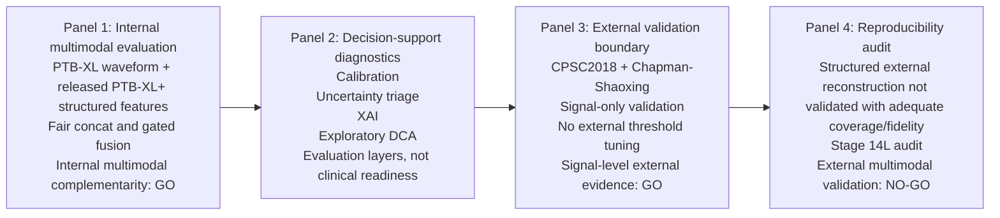

# Stage 17: BMC MIDM Submission Package Assembly

Date: 2026-06-30

Target journal: **BMC Medical Informatics and Decision Making**

Single-file delivery note: the attachment requested a formal multi-file assembly, but the user specifically requested a single Markdown document. This file therefore consolidates the submission draft, citation audit, bibliography, figure plan, visual abstract, cover letter, claim audit, checklist, and assembly log into one standalone Markdown artifact.

## 1. Locked Evidence Boundary

Allowed evidence:

- Internal PTB-XL/PTB-XL+ multimodal evaluation.
- Signal-only external validation on CPSC2018 and Chapman-Shaoxing.
- Stage 14L as a structured-feature reproducibility and feasibility audit.
- Calibration, uncertainty triage, XAI, and exploratory decision-curve analysis as conservative decision-support evaluation layers.

Forbidden claims:

- External multimodal validation was performed.
- Gated fusion is statistically clearly superior to fair concat.
- Exact external PTB-XL+ 531-column structured-feature reconstruction was achieved.
- Candidate ECGdeli/prototype features are official PTB-XL+ external structured features.
- The framework is clinically ready, clinically validated, deployable, or ready for real-world use.

## 2. BMC MIDM Submission Draft

# A Reproducibility-Aware Decision-Support Evaluation Framework for Multimodal ECG Risk Stratification

## Abstract

**Background:** Multimodal electrocardiogram (ECG) models can combine waveform representations with structured ECG-derived measurements, but public-data studies need to distinguish internal multimodal performance from external transportability and feature-reproducibility constraints. We evaluated a conservative decision-support framework for ECG-based cardiac risk stratification under explicit evidence boundaries.

**Methods:** We used PTB-XL waveforms and released PTB-XL+ structured features for internal development and evaluation across five diagnostic superclasses: NORM, MI, STTC, CD, and HYP. Model groups included a strong signal-only model, a signal-embedding multilayer perceptron, a structured-feature multilayer perceptron, fair multimodal concatenation, and gated fusion. Model selection, threshold tuning, and temperature scaling used internal validation data only. We assessed discrimination, calibration, uncertainty triage, post-hoc explainability, and exploratory decision-curve analysis. External evaluation was restricted to signal-only validation on CPSC2018 and Chapman-Shaoxing using pre-specified high-confidence label mappings. We separately audited whether structured PTB-XL+ compatible features could be reconstructed for external WFDB datasets.

**Results:** In internal PTB-XL/PTB-XL+ testing, fair multimodal concatenation improved over the signal-embedding comparator in AUROC, average precision, and F1, with paired bootstrap confidence intervals excluding zero. Gated fusion showed only small numerical differences from fair concatenation, and paired bootstrap confidence intervals for AUROC, average precision, and F1 all contained zero. Signal-only external validation achieved macro AUROC 0.9071 on CPSC2018 and 0.8742 on Chapman-Shaoxing, with lower average precision and F1 in low-prevalence Chapman-Shaoxing labels. External calibration showed distribution-shift effects. The Stage 14L structured-feature audit found 138 allclose features, reduced structured-only internal collapse, no stable reduced-schema multimodal gain, and only two joinable external structured records per dataset.

**Conclusions:** The framework supports reproducibility-aware internal multimodal evaluation with signal-level external validation, but not external multimodal validation. Further work requires externally reproducible structured features and prospective clinical data before clinical-use claims can be considered.

## Keywords

Electrocardiography; Clinical decision support; Multimodal fusion; Signal-level external validation; Model calibration; Uncertainty estimation; Explainable artificial intelligence; Reproducibility; Public datasets; Risk stratification.

## Background

Automated ECG interpretation has become an important test case for public-data medical artificial intelligence because 12-lead ECGs combine rich waveform structure, clinically meaningful measurements, and heterogeneous diagnostic labels. Public resources such as PTB-XL have enabled reproducible benchmarking for multi-label ECG classification, while PTB-XL+ extends this setting with structured ECG-derived features aligned to PTB-XL records [@wagner2020ptbxl; @goldberger2000physionet; @strodthoff2023ptbxlplus]. These resources make it possible to ask whether waveform representations and structured ECG measurements provide complementary information for cardiac risk stratification.

For health decision-support research, however, performance-only reporting is insufficient. A model with strong internal discrimination may still be poorly calibrated, unstable under distribution shift, difficult to audit, or dependent on features that cannot be reproduced outside the development dataset. Calibration matters because risk estimates may be interpreted as probabilities; uncertainty analysis can identify cases where prediction confidence is lower; explainability can support model auditing; and decision-curve analysis can explore threshold-dependent consequences [@guo2017calibration; @brier1950verification; @naeini2015calibration; @gal2016dropout; @geifman2017selective; @lundberg2017shap; @sundararajan2017integrated; @vickers2006dca]. None of these components establishes clinical readiness by itself, but together they provide a more cautious evaluation of whether a model behaves like a decision-support candidate rather than only a benchmark classifier.

Multimodal ECG studies face an additional reproducibility problem. Structured ECG features depend on delineation software, preprocessing choices, lead handling, and feature definitions. ECGdeli provides an open-source ECG delineation context, but a local delineation output is not automatically equivalent to a released PTB-XL+ structured-feature schema [@pilia2021ecgdeli; @strodthoff2023ptbxlplus]. If an internal multimodal model uses released structured values from one dataset, external multimodal validation is only justified when comparable structured features can be generated externally with adequate fidelity and coverage. External ECG datasets such as CPSC2018 and Chapman-Shaoxing also differ from PTB-XL in label scope, prevalence, and annotation structure [@liu2018cpsc; @zheng2020chapman; @alday2020physionet2020]. These differences make it important to separate internal multimodal gains from signal-level external transportability and from structured-feature reconstruction feasibility.

The gap addressed here is therefore not only model performance. Many public ECG artificial intelligence studies report internal metrics, but fewer explicitly separate internal multimodal evidence, external signal-only evaluation, calibration, uncertainty, explainability, decision-curve analysis, and structured-feature reproducibility. This distinction is especially relevant for medical informatics and decision-support research, where transparent evidence boundaries may be as important as incremental performance gains.

In this study, we evaluated a reproducibility-aware multimodal ECG decision-support framework using PTB-XL/PTB-XL+ internally and CPSC2018 and Chapman-Shaoxing externally. The objective was to test whether released PTB-XL+ structured features add internal value beyond ECG signal embeddings, whether simple fair concatenation is sufficient relative to gated fusion, how signal-only models behave on external datasets, and whether external structured features can be reconstructed with enough fidelity to support multimodal external validation. This was a conservative public-data evaluation, not a clinical deployment study.

## Methods

### Study design

This was a public-data model development and evaluation study. The primary internal analysis used PTB-XL waveforms and released PTB-XL+ structured features [@wagner2020ptbxl; @strodthoff2023ptbxlplus]. External validation used CPSC2018 and Chapman-Shaoxing waveforms for signal-only evaluation [@liu2018cpsc; @zheng2020chapman]. External structured-feature generation was audited for reproducibility and coverage feasibility, but external structured features were not used for validated multimodal external testing.

The evaluation was staged. Stage 0/1 verified PTB-XL local data layout, parsed diagnostic labels, and generated frozen train, validation, and test files. Internal modeling stages trained and compared signal-only, signal-embedding, structured-only, fair concat, and gated fusion models. Later stages evaluated calibration, uncertainty triage, XAI, exploratory decision-curve analysis, signal-only external validation, and structured-feature reproducibility.

### Data sources and roles

PTB-XL served as the internal waveform dataset. PTB-XL+ served as the internal released structured-feature resource. The internal label scope used five diagnostic superclasses: NORM, MI, STTC, CD, and HYP. Official PTB-XL split logic was preserved, with training, validation, and test partitions kept frozen throughout model development and evaluation.

CPSC2018 and Chapman-Shaoxing served as external waveform datasets for signal-only validation. CPSC2018 was evaluated for the high-confidence NORM/CD label subset. Chapman-Shaoxing was evaluated for MI/CD/HYP. Chapman-Shaoxing sinus rhythm was not treated as main-analysis NORM. Records that could not be read as WFDB waveforms were excluded. No external threshold tuning, external model selection, or external retraining was performed.

External structured features were treated as an audit target rather than a validation input. Candidate ECGdeli-derived features and concordant reduced-schema features were assessed for feasibility, but they were not considered official PTB-XL+ external structured features.

### Model groups

Five internal model groups were evaluated:

- Strong signal-only model using 100 Hz 12-lead PTB-XL waveforms.
- Signal-embedding MLP using a 256-dimensional signal representation.
- Structured-feature MLP using 531 released PTB-XL+ structured features.
- Fair MLP-concat model combining the 256-dimensional signal embedding with 531 structured features.
- Gated fusion MLP using the same signal and structured input interface.

The strong signal-only model used a one-dimensional residual network with 12 input channels and five output labels. Residual learning was used as the general architectural background [@he2016resnet]. The model provided both a direct waveform comparator and the 256-dimensional signal embedding for fair multimodal comparison. The fair fusion dataset combined signal embeddings and released structured features after median imputation and standardization defined on the training set.

### Fair comparison principle

The gated fusion model was compared against fair concat because multimodal gains should not be attributed to architectural complexity when a simple fusion strategy can capture similar information. Signal-embedding, structured-only, fair concat, and gated fusion models used the same frozen splits, label scope, validation-only early stopping, and validation-derived thresholds. This design was intended to isolate the contribution of modality complementarity from the contribution of extra model complexity.

### Calibration

Calibration was assessed using stored validation and test predictions. Temperature scaling was fit on internal validation logits and evaluated on frozen internal test predictions [@guo2017calibration]. For external signal-only calibration, the internally fitted temperature source was carried forward without external refitting. Reliability data, Brier score, expected calibration error, and maximum calibration error were reported [@brier1950verification; @naeini2015calibration]. External calibration was interpreted as behavior under distribution shift, not as clinical calibration readiness.

### Uncertainty triage

Uncertainty triage was evaluated as a conservative decision-support layer. Prediction uncertainty was used to compare retained subsets across coverage levels. These analyses were informed by uncertainty estimation and selective prediction concepts [@gal2016dropout; @geifman2017selective]. They were intended to describe whether lower-uncertainty predictions had more favorable internal performance, not to define a deployment-ready triage workflow.

### Explainability and XAI

Post-hoc explainability analyses included structured feature attribution, signal attribution case reports, and gate summaries where available. XAI outputs were used for model auditing and interpretation. Feature attribution and saliency-style outputs were interpreted cautiously, consistent with prior explainability methods and medical AI cautions [@lundberg2017shap; @sundararajan2017integrated; @selvaraju2017gradcam; @ghassemi2021xai]. They were not treated as evidence of causal clinical reasoning or mechanistic explanation.

### Decision-curve analysis

Decision-curve analysis was evaluated as an exploratory, threshold-dependent analysis [@vickers2006dca]. It was used to summarize internal net-benefit patterns across models and thresholds. It was not used to claim clinical utility or readiness for practice.

### Stage 14L structured-feature reproducibility audit

Stage 14L was treated as a core reproducibility and feasibility audit. Instead of continuing attempts to reconstruct the full PTB-XL+ 531-column schema externally, Stage 14L used a reduced structured-feature subset that had passed internal allclose checks in Stage 14H. This subset contained 138 features. The reduced schema was tested internally with signal-embedding, structured-only, and fair concat models, and external coverage was checked for CPSC2018 and Chapman-Shaoxing.

The go/no-go rule was conservative. External multimodal validation would only be considered if the reduced schema preserved internal multimodal gain and if external structured-feature coverage was adequate. If internal gain disappeared or external coverage was insufficient, external multimodal validation would remain NO-GO.

### Statistical analysis

Discrimination was summarized using macro AUROC, macro average precision, and macro F1. Thresholded metrics used thresholds selected on internal validation data. Fair concat was compared with the strongest unimodal comparators using paired record-level bootstrap resampling on the frozen internal test set. Gated fusion and fair concat were also compared using paired bootstrap resampling on the frozen internal test set [@efron1993bootstrap]. Bootstrap confidence intervals were reported without multiplicity adjustment and interpreted descriptively. External diagnostics were reported per dataset and per class. No external threshold optimization was performed.

## Results

### Internal full-schema multimodal evaluation

Internal full-schema PTB-XL/PTB-XL+ results supported multimodal complementarity. The strong signal-only model achieved test AUROC 0.9098, AP 0.7721, and F1 0.6998. The signal-embedding MLP achieved AUROC 0.9094, AP 0.7724, and F1 0.7002. The structured MLP achieved AUROC 0.9046, AP 0.7652, and F1 0.6899.

Fair MLP-concat achieved AUROC 0.9193, AP 0.7953, and F1 0.7208. Gated fusion MLP achieved AUROC 0.9196, AP 0.7978, and F1 0.7255. These results indicate that combining signal embeddings with released PTB-XL+ structured features improved internal performance over either unimodal comparator. The improvement should be interpreted as internal PTB-XL/PTB-XL+ evidence under frozen splits.

| Model | Test AUROC | Test AP | Test F1 |
|:---|---:|---:|---:|
| strong signal-only | 0.9098 | 0.7721 | 0.6998 |
| signal-embedding MLP | 0.9094 | 0.7724 | 0.7002 |
| structured MLP | 0.9046 | 0.7652 | 0.6899 |
| fair MLP-concat | 0.9193 | 0.7953 | 0.7208 |
| gated fusion MLP | 0.9196 | 0.7978 | 0.7255 |

### Statistical support for the internal multimodal gain

Paired record-level bootstrap analysis supported the internal fair concat gain over the signal-embedding comparator and the strong signal-only comparator. For fair concat minus signal-embedding MLP, the AUROC delta was +0.0098 with a 95% CI from +0.0067 to +0.0131, the AP delta was +0.0229 with a 95% CI from +0.0157 to +0.0302, and the F1 delta was +0.0205 with a 95% CI from +0.0088 to +0.0324. For fair concat minus strong signal-only, the AUROC delta was +0.0094 with a 95% CI from +0.0062 to +0.0127, the AP delta was +0.0232 with a 95% CI from +0.0151 to +0.0308, and the F1 delta was +0.0209 with a 95% CI from +0.0098 to +0.0319. None of these confidence intervals contained zero.

These results provide statistical support for the internal multimodal gain, while remaining limited to the PTB-XL/PTB-XL+ internal evaluation setting.

### Gated fusion versus fair concat

Gated fusion did not show a statistically clear advantage over fair concat. The paired bootstrap delta for AUROC was +0.0003 with a 95% CI from -0.0015 to 0.0021. The AP delta was +0.0025 with a 95% CI from -0.0014 to 0.0070. The F1 delta was +0.0047 with a 95% CI from -0.0044 to 0.0142. All confidence intervals contained zero.

These findings support a conservative interpretation: the internal multimodal gain is better attributed to modality complementarity than to an additional benefit from gating.

### Calibration and decision-support diagnostics

Internal temperature-scaled calibration was evaluated for the main model groups. Temperature scaling was fitted on internal validation data and evaluated on frozen test predictions. The strong signal-only model had macro Brier score 0.0903 and macro ECE 0.0320. The structured MLP had macro Brier score 0.0942 and macro ECE 0.0212. Fair concat had macro Brier score 0.0864 and macro ECE 0.0283. Gated fusion had macro Brier score 0.0844 and macro ECE 0.0193.

Uncertainty triage, XAI, and exploratory decision-curve analysis were retained as decision-support diagnostics. These analyses broadened evaluation beyond discrimination, but they were not interpreted as clinical readiness evidence.

### Signal-only external validation

CPSC2018 signal-only external validation included 9,944 evaluated records for the NORM/CD high-confidence label scope. Macro AUROC was 0.9071, macro AP was 0.6509, and macro F1 was 0.5904. This supports limited signal-level external transportability in the evaluated label subset.

Chapman-Shaoxing signal-only external validation included 45,150 evaluated records for the MI/CD/HYP high-confidence label scope. Macro AUROC was 0.8742, macro AP was 0.1727, and macro F1 was 0.1650. The Chapman-Shaoxing results suggest preserved ranking performance but weak AP and F1. Per-class diagnostics support this interpretation: MI had 123 positive cases with prevalence 0.0027, AP 0.0796, and F1 0.0277; CD had prevalence 0.0677, AP 0.2624, and F1 0.3319; and HYP had prevalence 0.0166, AP 0.1760, and F1 0.1353. These values should be interpreted in relation to low prevalence, label mapping, and transfer of thresholds selected on PTB-XL validation data.

External validation was signal-only. No external multimodal validation was performed.

### External signal-only calibration

External calibration was evaluated without external refitting. CPSC2018 had macro Brier 0.1268, micro Brier 0.1268, macro ECE 0.1262, and macro MCE 0.4099. Chapman-Shaoxing had macro Brier 0.0855, micro Brier 0.0855, macro ECE 0.1412, and macro MCE 0.7277.

These results should be reported as transparent calibration behavior under distribution shift, not as evidence of clinical calibration readiness.

### Stage 14L structured-feature reproducibility audit

Stage 14L found that only 138 structured features were available in the reproducibility-validated allclose subset. In the reduced-schema internal test, the signal-embedding MLP achieved AUROC 0.9094, AP 0.7722, and F1 0.6981. The reduced structured-only MLP collapsed, with AUROC 0.5704, AP 0.3045, and F1 0.0000. Reduced fair concat achieved AUROC 0.9097, AP 0.7731, and F1 0.6938, which did not show stable gain over the signal-embedding MLP.

External structured-feature coverage also failed the quality gate. CPSC2018 had 2 joinable candidate structured records among 9,944 signal prediction records, for coverage 0.000201. Chapman-Shaoxing had 2 joinable candidate structured records among 45,150 signal prediction records, for coverage 0.000044.

The Stage 14L decision was NO-GO for external multimodal validation. This should be presented as a structured-feature reproducibility and feasibility result, not as a failed external multimodal model.

## Discussion

### Principal findings

This study evaluated a reproducibility-aware decision-support framework for multimodal ECG risk stratification. The main finding is not only that multimodal fusion improved internal PTB-XL/PTB-XL+ performance. The broader finding is that multimodal ECG models should be evaluated with explicit evidence boundaries: internal multimodal performance, signal-level external validation, calibration, uncertainty, explainability, decision-curve analysis, and structured-feature reproducibility should not be collapsed into one broad validation claim.

The internal full-schema results showed that released PTB-XL+ structured features added value beyond ECG signal embeddings under frozen PTB-XL splits. Paired bootstrap analysis supported the fair concat gain over both the signal-embedding MLP and the strong signal-only comparator for AUROC, AP, and F1. Gated fusion was numerically close to fair concat, but paired bootstrap intervals contained zero for AUROC, AP, and F1. This finding argues against making architectural complexity the central claim. For a decision-support evaluation paper, the more defensible contribution is the fair comparison framework and the statistically supported internal modality complementarity.

### External validation and transportability

The external evidence is intentionally limited to signal-only validation. CPSC2018 supported limited signal-level external transportability for the NORM/CD high-confidence label subset. Chapman-Shaoxing showed preserved ranking performance but weak AP and F1, especially in low-prevalence labels. The per-class diagnostic table supports this explanation: Chapman-Shaoxing MI had only 123 positive cases among 45,150 evaluated records, with prevalence 0.0027, AP 0.0796, and F1 0.0277. This pattern is consistent with label mapping constraints, prevalence differences, and transfer of thresholds selected on internal validation data. The absence of external threshold tuning strengthens the evaluation protocol but also limits thresholded performance.

These results should not be used to claim external multimodal validation. They show how the signal model behaves across external ECG waveform datasets under constrained label mappings. They do not test whether PTB-XL+ structured features generalize externally, because externally compatible structured features were not validated.

### Decision-support evaluation layers

Calibration, uncertainty triage, XAI, and decision-curve analysis provided complementary evaluation layers. Calibration results described probability behavior under internal testing and external distribution shift. Uncertainty triage examined whether lower-uncertainty retained subsets had more favorable internal behavior. XAI outputs supported model auditing and interpretability. Decision-curve analysis summarized threshold-dependent internal net-benefit patterns. These components are useful for decision-support evaluation, but none establishes clinical readiness. They should be described as safety- and audit-oriented diagnostics rather than deployment evidence.

### Structured-feature reproducibility as a central finding

Stage 14L is a key BMC MIDM-compatible contribution because it shows why external multimodal claims are difficult in public multimodal ECG research. The audit found that a reproducibility-validated allclose subset contained only 138 features. This subset did not preserve internal multimodal gain, and external joinable structured coverage was only two records per external dataset. The practical implication is that released internal PTB-XL+ features can support internal multimodal experiments, but de novo reconstruction of the same structured schema on external WFDB datasets was not validated.

This distinction protects the internal findings while clarifying the external limitation. Internal multimodal experiments remain reproducible because they use released PTB-XL+ feature values under frozen splits. The reproducibility limitation concerns de novo external reconstruction of the same structured-feature schema, not reuse of the released PTB-XL+ resource.

### Strengths

The study's main strength is transparent boundary-setting. It avoids claiming more than the data support and directly reports negative or near-null findings, including the gated-versus-concat null result and the Stage 14L external multimodal NO-GO decision. This approach is well suited to medical informatics, where model-performance claims need to be connected to reproducibility, calibration, external transportability, and auditability.

### Limitations

Several limitations should be emphasized. First, all analyses used public retrospective datasets. Second, no prospective validation was performed. Third, external validation was signal-only; there was no validated external multimodal evaluation. Fourth, thresholds were not tuned on external test labels, which avoids overfitting but can reduce F1 under prevalence shift. Fifth, label mappings across PTB-XL, CPSC2018, and Chapman-Shaoxing were necessarily incomplete. Sixth, exact external reconstruction of PTB-XL+ structured features was not achieved. Seventh, decision-curve analysis was exploratory, internal, and threshold-dependent. Eighth, no clinical workflow, clinician interaction, or patient-outcome study was performed.

## Conclusions

This framework supports reproducibility-aware evaluation of multimodal ECG risk stratification and demonstrates internal multimodal complementarity with signal-level external validation. Simple fair concat captured the main internal multimodal gain, while gated fusion did not provide statistically clear additional benefit. External multimodal validation remains unavailable because PTB-XL+ compatible structured-feature reconstruction was not validated externally with adequate coverage and fidelity. Further work with externally reproducible structured features and prospective clinical data is needed before clinical-use claims can be considered.

## List of Abbreviations

AP: average precision; AUROC: area under the receiver operating characteristic curve; CD: conduction disturbance; DCA: decision-curve analysis; ECG: electrocardiogram; ECE: expected calibration error; F1: F1 score; HYP: hypertrophy; MI: myocardial infarction; MLP: multilayer perceptron; MCE: maximum calibration error; NORM: normal ECG; PTB-XL: Physikalisch-Technische Bundesanstalt large ECG dataset; STTC: ST/T change; XAI: explainable artificial intelligence.

## Declarations

### Ethics approval and consent to participate

This study used publicly available, de-identified datasets. Ethical approval and consent procedures were handled by the original dataset creators as described in the corresponding dataset publications and repositories. No new human participants were recruited for this secondary analysis. No new institutional review board approval number is reported here.

### Consent for publication

Not applicable.

### Availability of data and materials

PTB-XL is available from PhysioNet at https://physionet.org/content/ptb-xl/. PTB-XL+ is available from PhysioNet at https://physionet.org/content/ptb-xl-plus/. CPSC2018 is available from the China Physiological Signal Challenge 2018 website at http://2018.icbeb.org/Challenge.html. The Chapman-Shaoxing ECG database is available from PhysioNet at https://physionet.org/content/ecg-arrhythmia/. The analysis code will be made available at: [GitHub/Zenodo URL to be added before submission].

### Competing interests

The authors declare that they have no competing interests. This statement should be confirmed by all authors before submission.

### Funding

[Funding information to be added. If no specific funding was received, state: The authors received no specific funding for this work.]

### Authors' contributions

[Author initials and contributions to be added according to the final author list. Suggested contribution categories include conceptualization, data curation, methodology, software, validation, formal analysis, visualization, writing - original draft, writing - review and editing, and supervision.]

### Acknowledgements

[Acknowledgements to be added. If none, state: Not applicable.]

## References

The manuscript uses citation keys from the BibTeX section below. The references are listed in BMC-compatible prose form in the bibliography section.

## Figure Legends

**Figure 1. Study design and evidence boundaries.** PTB-XL/PTB-XL+ were used for internal multimodal model development and evaluation. CPSC2018 and Chapman-Shaoxing were used for signal-only external validation. Structured-feature reconstruction was audited but did not provide sufficient external coverage/fidelity to support external multimodal validation. No clinical deployment claim is made.

**Figure 2. Internal model performance and statistically supported multimodal gain.** Internal frozen-test AUROC, AP, and F1 are shown for strong signal-only, signal-embedding MLP, structured MLP, fair concat, and gated fusion models. Paired bootstrap analysis supported fair concat improvement over signal-embedding MLP and strong signal-only comparators, whereas gated fusion did not show a statistically clear additional benefit over fair concat.

**Figure 3. Signal-only external validation.** Macro AUROC, AP, and F1 are shown for CPSC2018 and Chapman-Shaoxing under pre-specified high-confidence label mappings. Chapman-Shaoxing AP/F1 should be interpreted with low prevalence, label mapping, and internal-threshold transfer.

**Figure 4. Calibration and reliability under internal testing and external distribution shift.** Calibration and reliability summaries are shown for internal models and external signal-only predictions. Temperature scaling was fit on internal validation data and not refit externally.

**Supplementary Figure S1. Stage 14L structured-feature reproducibility audit.** The reproducibility-validated reduced structured schema contained 138 allclose features. Reduced structured-only performance collapsed internally, reduced fair concat did not preserve stable multimodal gain, and external structured-feature coverage was two joinable records per external dataset.

**Supplementary Figure S2. Optional post-hoc XAI example.** Existing signal and structured attribution outputs are shown as model-auditing examples. These explanations should not be interpreted as causal clinical reasoning.

## Supplementary Material List

- Supplementary Table S1: External signal-only per-class diagnostics.
- Supplementary Table S2: External signal-only calibration.
- Supplementary Table S3: Stage 14L structured-feature reproducibility audit.
- Supplementary Figure S1: Stage 14L structured-feature reproducibility audit.
- Supplementary Figure S2: Optional post-hoc XAI example if retained.

## 3. Formal Bibliography File Content

The following content should be split into `manuscript/references.bib` if a multi-file package is prepared.

```bibtex
@article{wagner2020ptbxl,
  title = {PTB-XL, a large publicly available electrocardiography dataset},
  author = {Wagner, Patrick and Strodthoff, Nils and Bousseljot, Ralf-Dieter and Kreiseler, Dieter and Lunze, Friedhelm I and Samek, Wojciech and Schaeffter, Tobias},
  journal = {Scientific Data},
  volume = {7},
  pages = {154},
  year = {2020},
  doi = {10.1038/s41597-020-0495-6}
}

@article{goldberger2000physionet,
  title = {PhysioBank, PhysioToolkit, and PhysioNet: components of a new research resource for complex physiologic signals},
  author = {Goldberger, Ary L and Amaral, Luis AN and Glass, Leon and Hausdorff, Jeffrey M and Ivanov, Plamen Ch and Mark, Roger G and Mietus, Joseph E and Moody, George B and Peng, Chung-Kang and Stanley, H Eugene},
  journal = {Circulation},
  volume = {101},
  number = {23},
  pages = {e215--e220},
  year = {2000}
}

@article{strodthoff2023ptbxlplus,
  title = {PTB-XL+, a comprehensive electrocardiographic feature dataset},
  author = {Strodthoff, Nils and Mehari, Temesgen and Nagel, Claudia and Aston, Philip J and Sundar, Ashish and Graff, Claus and Kanters, Jorgen K and Haverkamp, Wilhelm and Doessel, Olaf and Loewe, Axel and Bar, Markus and Schaeffter, Tobias},
  journal = {Scientific Data},
  volume = {10},
  pages = {279},
  year = {2023},
  doi = {10.1038/s41597-023-02153-8}
}

@article{pilia2021ecgdeli,
  title = {ECGdeli: An open source ECG delineation toolbox for MATLAB},
  author = {Pilia, Nicolas and Nagel, Claudia and Lenis, Gabriel and Becker, Sebastian and Doessel, Olaf and Loewe, Axel},
  journal = {SoftwareX},
  volume = {13},
  pages = {100639},
  year = {2021},
  doi = {10.1016/j.softx.2020.100639}
}

@article{strodthoff2021benchmark,
  title = {Deep learning for ECG analysis: benchmarks and insights from PTB-XL},
  author = {Strodthoff, Nils and Wagner, Patrick and Schaeffter, Tobias and Samek, Wojciech},
  journal = {IEEE Journal of Biomedical and Health Informatics},
  volume = {25},
  pages = {1519--1528},
  year = {2021},
  doi = {10.1109/JBHI.2020.3022989}
}

@inproceedings{he2016resnet,
  title = {Deep residual learning for image recognition},
  author = {He, Kaiming and Zhang, Xiangyu and Ren, Shaoqing and Sun, Jian},
  booktitle = {Proceedings of the IEEE Conference on Computer Vision and Pattern Recognition},
  pages = {770--778},
  year = {2016}
}

@article{liu2018cpsc,
  title = {An open access database for evaluating the algorithms of electrocardiogram rhythm and morphology abnormality detection},
  author = {Liu, Feifei and Liu, Changqing and Zhao, Lina and Zhang, Xiangyu and Wu, Xue and Xu, Xue and Liu, Yulin and Ma, Chen and Wei, Shoushui and He, Zhigang and Li, Jianqing and Ng, EYK},
  journal = {Journal of Medical Imaging and Health Informatics},
  volume = {8},
  pages = {1368--1373},
  year = {2018},
  doi = {10.1166/jmihi.2018.2442}
}

@article{zheng2020chapman,
  title = {A 12-lead electrocardiogram database for arrhythmia research covering more than 10,000 patients},
  author = {Zheng, Jianwei and Zhang, Jianming and Danioko, Salim and Yao, Hai and Guo, Hangyuan and Rakovski, Cyril},
  journal = {Scientific Data},
  volume = {7},
  pages = {48},
  year = {2020},
  doi = {10.1038/s41597-020-0386-x}
}

@article{alday2020physionet2020,
  title = {Classification of 12-lead ECGs: the PhysioNet/Computing in Cardiology Challenge 2020},
  author = {Alday, Erick A Perez and Gu, Annie and Shah, Amit J and Robichaux, Caitlin and Wong, Annie K I and Liu, Chengyu and Liu, Feifei and Rad, Alireza Bahrami and Elola, Andoni and Seyedi, Salman and others},
  journal = {Physiological Measurement},
  volume = {41},
  pages = {124003},
  year = {2020},
  doi = {10.1088/1361-6579/abc960}
}

@inproceedings{guo2017calibration,
  title = {On calibration of modern neural networks},
  author = {Guo, Chuan and Pleiss, Geoff and Sun, Yu and Weinberger, Kilian Q},
  booktitle = {Proceedings of the 34th International Conference on Machine Learning},
  volume = {70},
  pages = {1321--1330},
  year = {2017}
}

@article{brier1950verification,
  title = {Verification of forecasts expressed in terms of probability},
  author = {Brier, Glenn W},
  journal = {Monthly Weather Review},
  volume = {78},
  pages = {1--3},
  year = {1950}
}

@inproceedings{naeini2015calibration,
  title = {Obtaining well calibrated probabilities using Bayesian binning},
  author = {Naeini, Mahdi Pakdaman and Cooper, Gregory F and Hauskrecht, Milos},
  booktitle = {Proceedings of the AAAI Conference on Artificial Intelligence},
  volume = {29},
  year = {2015}
}

@inproceedings{gal2016dropout,
  title = {Dropout as a Bayesian approximation: representing model uncertainty in deep learning},
  author = {Gal, Yarin and Ghahramani, Zoubin},
  booktitle = {Proceedings of the 33rd International Conference on Machine Learning},
  volume = {48},
  pages = {1050--1059},
  year = {2016}
}

@inproceedings{geifman2017selective,
  title = {Selective classification for deep neural networks},
  author = {Geifman, Yonatan and El-Yaniv, Ran},
  booktitle = {Advances in Neural Information Processing Systems},
  volume = {30},
  year = {2017}
}

@inproceedings{lundberg2017shap,
  title = {A unified approach to interpreting model predictions},
  author = {Lundberg, Scott M and Lee, Su-In},
  booktitle = {Advances in Neural Information Processing Systems},
  volume = {30},
  year = {2017}
}

@inproceedings{sundararajan2017integrated,
  title = {Axiomatic attribution for deep networks},
  author = {Sundararajan, Mukund and Taly, Ankur and Yan, Qiqi},
  booktitle = {Proceedings of the 34th International Conference on Machine Learning},
  volume = {70},
  pages = {3319--3328},
  year = {2017}
}

@inproceedings{selvaraju2017gradcam,
  title = {Grad-CAM: Visual explanations from deep networks via gradient-based localization},
  author = {Selvaraju, Ramprasaath R and Cogswell, Michael and Das, Abhishek and Vedantam, Ramakrishna and Parikh, Devi and Batra, Dhruv},
  booktitle = {IEEE International Conference on Computer Vision},
  pages = {618--626},
  year = {2017}
}

@article{vickers2006dca,
  title = {Decision curve analysis: a novel method for evaluating prediction models},
  author = {Vickers, Andrew J and Elkin, Elena B},
  journal = {Medical Decision Making},
  volume = {26},
  pages = {565--574},
  year = {2006},
  doi = {10.1177/0272989X06295361}
}

@book{efron1993bootstrap,
  title = {An Introduction to the Bootstrap},
  author = {Efron, Bradley and Tibshirani, Robert J},
  publisher = {Chapman and Hall/CRC},
  address = {New York},
  year = {1993}
}

@article{delong1988roc,
  title = {Comparing the areas under two or more correlated receiver operating characteristic curves: a nonparametric approach},
  author = {DeLong, Elizabeth R and DeLong, David M and Clarke-Pearson, Daniel L},
  journal = {Biometrics},
  volume = {44},
  pages = {837--845},
  year = {1988}
}

@article{ghassemi2021xai,
  title = {The false hope of current approaches to explainable artificial intelligence in health care},
  author = {Ghassemi, Marzyeh and Oakden-Rayner, Luke and Beam, Andrew L},
  journal = {The Lancet Digital Health},
  volume = {3},
  pages = {e745--e750},
  year = {2021},
  doi = {10.1016/S2589-7500(21)00208-9}
}
```

## 4. References Audit

| Manuscript section | Claim or method | Citation key(s) inserted | Verification status | Unresolved TODO |
|:---|:---|:---|:---|:---|
| Background | PTB-XL public ECG resource | `wagner2020ptbxl`, `goldberger2000physionet` | verified from Stage 16 audit | none |
| Background | PTB-XL+ released structured features | `strodthoff2023ptbxlplus` | verified from Stage 16 audit | none |
| Background/Methods | ECGdeli/delineation context | `pilia2021ecgdeli` | verified from prior project citation | final DOI formatting check before submission |
| Background | CPSC2018 and Chapman-Shaoxing external dataset context | `liu2018cpsc`, `zheng2020chapman`, `alday2020physionet2020` | verified from Stage 16 audit | none |
| Methods | Residual learning architecture | `he2016resnet` | verified | cite only for architecture background |
| Methods | Temperature scaling and calibration | `guo2017calibration`, `brier1950verification`, `naeini2015calibration` | verified | none |
| Methods | Uncertainty and selective prediction | `gal2016dropout`, `geifman2017selective` | verified | none |
| Methods | XAI / attribution | `lundberg2017shap`, `sundararajan2017integrated`, `selvaraju2017gradcam`, `ghassemi2021xai` | verified | match final text to exact implemented attribution methods |
| Methods | Decision-curve analysis | `vickers2006dca` | verified | none |
| Methods | Bootstrap confidence intervals | `efron1993bootstrap` | verified | none |
| Optional | Correlated AUROC comparison background | `delong1988roc` | verified | not necessary unless ROC comparison background is discussed |

## 5. Final Figure Plan

No new experiments are required. Existing source data and rendered figures should be reused. Figures not already rendered in a BMC-specific form are marked pending rather than invented.

| Figure | Source data | Existing rendered file | Proposed output path | Rendering status |
|:---|:---|:---|:---|:---|
| Figure 1. Study design and evidence boundary | `figures/source_data/fig1_framework_nodes.csv`; `figures/source_data/fig1_framework_edges.csv` | `figures/fig1_framework_draft.mmd` | `manuscript/figures/figure1_study_design_evidence_boundary.png` | pending BMC rendering |
| Figure 2. Internal model performance and multimodal gain | `figures/source_data/fig2_model_performance_long.csv`; `manuscript/tables/table_internal_multimodal_gain_bootstrap.csv` | `figures/main/fig2_model_performance.png`; `figures/main/fig3_ablation_complementarity.png` | `manuscript/figures/figure2_internal_model_performance.png` | partially complete; needs BMC relabeling |
| Figure 3. External signal-only validation | `tables/table_external_signal_results.csv`; `manuscript/tables/supp_table_external_per_class_diagnostics.csv` | none identified | `manuscript/figures/figure3_external_signal_only_validation.png` | pending rendering |
| Figure 4. Calibration/reliability | `figures/source_data/fig4_calibration_long.csv`; `results/calibration/reliability_curve_source_data.csv`; `tables/table_stage15_external_signal_calibration.csv` | `figures/main/fig4_calibration.png`; `figures/calibration/reliability_comparison_main_models.png` | `manuscript/figures/figure4_calibration_reliability.png` | partially complete; external calibration panel pending |
| Supplementary Figure S1. Stage 14L reproducibility audit | `tables/stage14l_internal_results.csv`; `tables/stage14l_external_results.csv`; `tables/stage14l_feature_manifest.csv` | none identified | `manuscript/figures/supp_figure_s1_stage14l_audit.png` | pending rendering |
| Supplementary Figure S2. Optional XAI example | `figures/source_data/fig6_xai_case_source_data.csv`; `figures/source_data/fig6_signal_heatmap_index.csv`; `figures/source_data/fig6_structured_feature_group_attribution.csv` | `figures/xai/fig_xai_representative_cases.png`; `figures/xai/xai_uncertainty_examples.png` | `manuscript/figures/supp_figure_s2_xai_example.png` | complete candidate exists; optional |

## 6. Visual Abstract Draft



Visual abstract text:

> We evaluated a reproducibility-aware ECG decision-support framework. Internal PTB-XL/PTB-XL+ experiments supported multimodal complementarity when ECG signal embeddings were combined with released structured features. Conservative decision-support diagnostics assessed calibration, uncertainty, XAI, and exploratory decision-curve behavior. External evaluation was restricted to signal-only validation on CPSC2018 and Chapman-Shaoxing. A structured-feature reproducibility audit found insufficient external coverage/fidelity for multimodal external validation, which remained NO-GO.

## 7. Cover Letter Draft

Dear Editors,

We are pleased to submit our manuscript, **"A Reproducibility-Aware Decision-Support Evaluation Framework for Multimodal ECG Risk Stratification,"** for consideration in **BMC Medical Informatics and Decision Making**.

This study presents a conservative public-data evaluation framework for ECG-based cardiac risk stratification. Rather than focusing only on model discrimination, the manuscript evaluates internal multimodal performance together with calibration, uncertainty triage, post-hoc explainability, exploratory decision-curve analysis, signal-level external validation, and structured-feature reproducibility auditing. We believe this framing is well aligned with BMC Medical Informatics and Decision Making because it emphasizes transparent evidence boundaries for clinical decision-support modeling.

The evidence boundary is explicit. PTB-XL/PTB-XL+ were used for internal multimodal evaluation. CPSC2018 and Chapman-Shaoxing were used for signal-only external validation. Stage 14L was treated as a structured-feature reproducibility and feasibility audit. The manuscript does not claim external multimodal validation.

External validation was intentionally restricted to signal-only evaluation because external PTB-XL+ compatible structured-feature reconstruction was not validated with adequate coverage and fidelity. The study also makes no clinical readiness, clinical validation, or clinical deployment claim.

This manuscript is original work, is not under consideration elsewhere, and has been approved for submission by all authors. Conflicts of interest: [statement to be finalized by all authors].

Sincerely,

[Corresponding author name, affiliation, and contact information to be added]

## 8. Final Claim Audit

| Phrase searched | Status | Required action |
|:---|:---|:---|
| external multimodal validation | Appears only as a boundary, limitation, or NO-GO statement | Keep explicit negation. |
| clinically ready | Forbidden except in negative/boundary wording | Do not use as a positive claim. |
| clinically validated | Forbidden except in negative/boundary wording | Do not use as a positive claim. |
| clinical deployment | Forbidden except in negative/boundary wording | Do not use as a positive claim. |
| deployable | Forbidden except in negative/boundary wording | Do not use as a positive claim. |
| real-world deployment | Avoid | Not needed in final manuscript. |
| clinical utility proven | Forbidden | Do not use. |
| clinically meaningful improvement | Avoid | Use statistically supported internal improvement. |
| gated fusion superiority | Forbidden | Use no statistically clear additional benefit from gating. |
| superior gated fusion | Forbidden | Do not use. |
| robust clinical utility | Forbidden | Do not use. |
| insufficient coverage/fidelity | Allowed | Use for Stage 14L external structured-feature audit. |

Claim audit result:

**Passed for a BMC MIDM decision-support evaluation manuscript.** The package remains an internal multimodal plus signal-only external validation study, with Stage 14L framed as a reproducibility audit.

## 9. Submission Checklist

| Item | Status | Notes |
|:---|:---|:---|
| Structured abstract under 350 words | complete | Abstract approximately 286 words. |
| Keywords 3-10 | complete | Ten keywords included. |
| References inserted | complete | Citation keys inserted into draft text. |
| Bibliography file created | complete within this single Markdown | Split into `references.bib` if multi-file package is later required. |
| References audit complete | complete | Included above. |
| Multiplicity wording added | complete | Exact sentence included in Statistical analysis. |
| Main internal multimodal gain bootstrap support reported | complete | Fair concat vs signal-embedding and strong signal-only CIs exclude zero. |
| Gated-vs-fair null conclusion preserved | complete | No statistically clear additional benefit from gating. |
| External validation remains signal-only | complete | Explicitly stated. |
| Stage 14L framed as reproducibility audit | complete | Explicitly stated. |
| Dataset URLs inserted | complete | PTB-XL, PTB-XL+, CPSC2018, Chapman-Shaoxing URLs included. |
| Code URL | pending | `[GitHub/Zenodo URL to be added before submission]`. |
| Cover letter draft complete | complete | Included above. |
| Visual abstract draft complete | complete | Included above. |
| Figure package rendered | pending | Existing figures available; BMC-specific Figure 1/3/S1 pending. |
| Author contributions | pending | Requires final author list. |
| Funding | pending | Requires author input. |
| Competing interests | pending | Requires author confirmation. |
| Acknowledgements | pending | Requires author input. |
| Final claim audit passed | complete | Passed with locked evidence boundary. |
| No external multimodal validation claim | complete | Maintained as NO-GO. |
| No clinical readiness/deployment claim | complete | Maintained as not a deployment study. |
| No gated fusion superiority claim | complete | Maintained as no statistically clear additional benefit. |

## 10. Stage 17 Assembly Log

Files represented in this single-md assembly:

- `manuscript/ECG_PTBXL_BMC_MIDM_SUBMISSION_DRAFT.md`
- `manuscript/references.bib`
- `manuscript/BMC_MIDM_REFERENCES_AUDIT.md`
- `manuscript/BMC_MIDM_FINAL_FIGURE_PLAN.md`
- `manuscript/BMC_MIDM_VISUAL_ABSTRACT_DRAFT.md`
- `manuscript/BMC_MIDM_COVER_LETTER_DRAFT.md`
- `manuscript/BMC_MIDM_FINAL_CLAIM_AUDIT.md`
- `manuscript/BMC_MIDM_SUBMISSION_CHECKLIST.md`
- `manuscript/BMC_MIDM_STAGE17_ASSEMBLY_LOG.md`

Because the user requested one standalone Markdown file, these components were consolidated here instead of being split into separate files.

References inserted:

- Dataset and resource citations: PTB-XL, PhysioNet, PTB-XL+, ECGdeli, CPSC2018, Chapman-Shaoxing.
- Model/method citations: ResNet, calibration, Brier score, ECE, uncertainty, selective prediction, XAI, DCA, bootstrap.

Figures rendered:

- No new BMC-specific figures were rendered in this single-md assembly step.
- Existing rendered candidates are available under `figures/main/`, `figures/calibration/`, `figures/uncertainty/`, `figures/dca/`, and `figures/xai/`.

Figures pending:

- BMC-specific Figure 1 evidence-boundary diagram.
- BMC-specific Figure 3 external signal-only validation plot.
- BMC-specific Supplementary Figure S1 Stage 14L audit plot.
- Figure 2 and Figure 4 have existing rendered candidates but need BMC MIDM relabeling.

Claim audit result:

- Passed.
- No external multimodal validation claim.
- No clinical readiness/deployment claim.
- No gated fusion superiority claim.

Remaining final submission blockers:

- Final author list, affiliations, and author contributions.
- Funding and competing-interest confirmation.
- Code repository or Zenodo URL.
- BMC-specific figure rendering.
- Final reference formatting if the journal requires a different style than the current BibTeX keys.

## 11. Final Quality Gate

Stage 17 single-md assembly status:

**GO for BMC MIDM submission-close review.**

Remaining before actual submission:

- Split this single Markdown into formal package files if the journal workflow requires separate manuscript, cover letter, `.bib`, and checklist files.
- Render final BMC-specific figures.
- Add author-specific administrative information.
- Add final code repository URL.

Final boundary:

**This remains a BMC MIDM-compatible public-data decision-support evaluation study. It is not an external multimodal validation paper and not a clinical deployment paper.**
