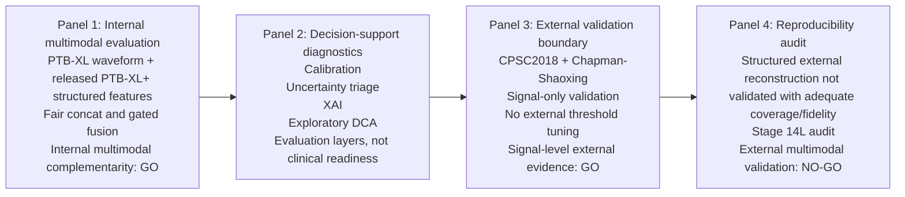

# BMC MIDM Visual Abstract Draft

Visual abstract text:

> We evaluated a reproducibility-aware ECG decision-support framework. Internal PTB-XL/PTB-XL+ experiments supported multimodal complementarity when ECG signal embeddings were combined with released structured features. Conservative decision-support diagnostics assessed calibration, uncertainty, XAI, and exploratory decision-curve behavior. External evaluation was restricted to signal-only validation on CPSC2018 and Chapman-Shaoxing. A structured-feature reproducibility audit found insufficient external coverage/fidelity for multimodal external validation, which remained NO-GO.
